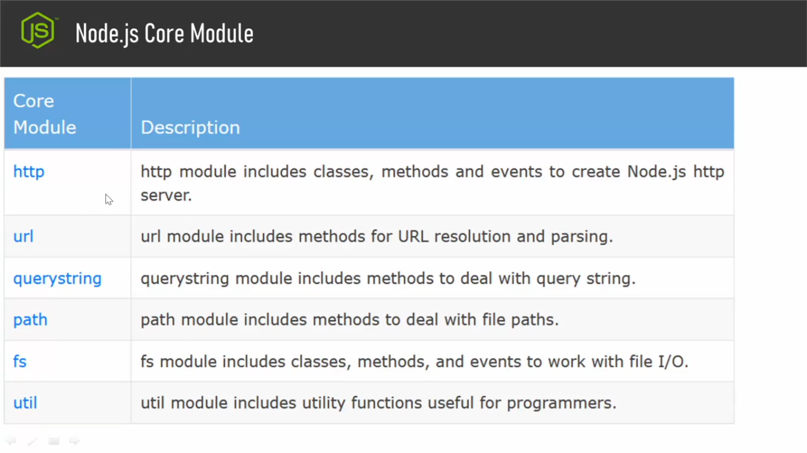

## What is Module?
- ### Module hocce onkgula code er shomoshti ba bundle. Dorun apni onkgula Class likhecen, onkgula property likhecen, onkgula method likhecen, akn sobgula class,property method aigula shob eksathe kore apni jodi ekti shomoshti toiri koren j shomoshti ti apni jokon khushi jekhane icce shekhane include kore bebohar korte parben tokon oi shomoshti tikhe bola hocce module. 

- ### Orthad module hocce code er shomoshti. J code er shomoshti tikhe apni jokon khushi jekhane khusi shekhane bar bar reuse korte parben.

- ### Reuseable kicu code er shomoshtie hocce Module.

- ### Nodejs er bithore amra 3 dhoroner module niye kaj korbo:
    1. ### Core Modules: Core Modules er mane hocce nodejs platform jta shei platform akta library provide korce. Toh nodejs platform er j nijossho module gula ache shei module gula k amra bolci Core Modules. 
    2. ### Local Modules: Jodi apni nije tekhe module toiri koren, nodejs er moddhe bebohar korer jonno. Sha module gula k tokon amra bolbo Local Module.
    3. ### Third Party Modules: Baire tekhe kono module jodi apni amdani kore niye eshe use koren shekhetre shei module gula k bolbo amra third party module.
- ### Toh nodejs diye jokon amra application develop korbo, application develop korer jonno kintu ei 3 dhoroner module niyey kaj korte hobe.
    - ### Nodejs platform k manage korer jonno nodejs er j core module gula ache shei module gula niye amader kaj korte hobe. 
    - ### Tarpore bibinno Thirdparty module amra bebohar korbo amader bibinno  kajer jonno.
    - ### Achara proyojon onushare jekhane jekhane dorkar hobe shekhane shekhane kintu amra nijera o module toiri korbo.
---

## Akhn Node js er j core module shekhane ashole ki ki ache?

- ###
    - ### Toh nodejs er core module er moddhe ace, http module, url module, query string module, path module, fs module(fs mane hocce file system), util module.
    - ### Akhn ai j http module name a j module ti ache node js er, Ei module er bithore j class ache, methods ache, property gula ache, aigula diye amra kori ki, aigula diye amra nodejs platform er http er server toiri kori. 
    - ### Orthad nodejs platformer j server ta run hobe sha server ta k manage korer jonno amra http module bebohar korbo.
    - ### aichara url module jta, url module diye apni korte parben ki, url resolution kora, parsing kora, ai bishoi gula k manage korer jonno apni url module k use korben.
    - ### aichara apni jodi querystring gula k manage korte jan shekhetre apnake querystring module bebohar korte hobe.
    - ### Tarpor hocce, bibinno file folder er j path gula ace, path location, sha path location gula k manage korer jonno apnake path module bebohar korte hobe.
    - ### aichara apni jodi file niye kaj korte chan, jerokom hocce file er input, output, file delete kora, file read kora, file create kora, file update kora, ai bishoi niye apni jodi kaj korte chan shekhetre apnake fs module bebohar korte hobe.
    - ### aicharao r o beshkicu module ache, jgula amader jonno beshi developer friendly hobe shegula k aber eksathe bola hocce utility module ba util module. 
    - ### Toh nodejs shekar jonno, prothomei amdaer k nodejs platform j core module gula provide korce sha core module gula kivabe kaj kore, shegula k include kore kivabe kaj korte hoi, shei bishoi gula amader shikhe nite hobe.
    - ### Then jokon amra core module gula sob shikhe felbo, tokon amra nijera kivabe module toiri korte pari sheta shikbo. Mojar bepar holo apni j local module ti toiri korben, apni caile sheta k onnoder beboharer jonno diye dite paren.  
- ### finally amra third party module bebohar kora shikbo.
- ### Er por nodejs er fundamental bishoy gula shekar pore amra nodejs er framework express js shikbo.

---
***
___
# Ami nije jegula porechi Chatgpt teke shegular note:

In Node.js, a **module** is a reusable block of code that can be imported and exported between different parts of your application. Modules help organize code into smaller, manageable pieces, improving maintainability and scalability.

### Types of Modules in Node.js
1. **Core Modules**  
   Built-in modules provided by Node.js (e.g., `fs`, `http`, `path`, `os`). These modules do not need to be installed and can be directly imported.

2. **Local Modules**  
   Custom modules you create in your application. These could be files or directories containing code specific to your project.

3. **Third-Party Modules**  
   Modules installed from the Node.js ecosystem (e.g., libraries from npm like `express` or `axios`).

---

### Importing and Exporting Modules
#### Example of Core Module:
```javascript
const fs = require('fs'); // Import the 'fs' core module
fs.writeFileSync('example.txt', 'Hello, Node.js!');
```

#### Example of Local Module:
Create a file `math.js`:
```javascript
// math.js
exports.add = (a, b) => a + b;
exports.subtract = (a, b) => a - b;
```

Import and use it in another file:
```javascript
// app.js
const math = require('./math');
console.log(math.add(5, 3));       // Output: 8
console.log(math.subtract(5, 3)); // Output: 2
```

#### Example of Third-Party Module:
Install the module using npm:
```bash
npm install moment
```

Use it in your code:
```javascript
const moment = require('moment');
console.log(moment().format('YYYY-MM-DD')); // Outputs the current date
```

---
---
___

### ami question korechi chatgpt k: Tell me "// math.js exports.add = (a, b) => a + b; exports.subtract = (a, b) => a - b;" here add and sutracts are separate module or a single module?

In the provided code:

```javascript
// math.js
exports.add = (a, b) => a + b;
exports.subtract = (a, b) => a - b;
```

**`add` and `subtract` are part of a single module.**  

This is because the entire `math.js` file is treated as a single module. The `exports` object is being used to define multiple functions (`add` and `subtract`) within this module. When you use `require('./math')`, you are importing the entire `math.js` module, including both `add` and `subtract` functions.

### How Modules Work Here:
- **Module name:** The file `math.js` itself is the module.
- **Exports:** `add` and `subtract` are properties of the `exports` object, so they are functionalities exposed by the `math.js` module.

### Importing the Module:
```javascript
const math = require('./math'); // Import the entire module
console.log(math.add(2, 3));      // Access the `add` function
console.log(math.subtract(5, 2)); // Access the `subtract` function
```

If you want to separate `add` and `subtract` into completely independent modules, you would need to create two separate files (e.g., `add.js` and `subtract.js`).


---
___
***

### Ami question korechi chatgpt k: what if i did not export add method ? will not it be part of module? and even ifi import math couldn't i use add?

If you do not export the `add` method, it will not be part of the module's public interface. This means that even if you import the `math` module, the `add` method will not be accessible outside of `math.js`. Here's why:

### How Exporting Works:
When you use `module.exports` or `exports`, you're explicitly specifying what should be exposed from the module. Only the methods, properties, or variables that are exported will be available to the code that imports the module.

---

### Example: Not Exporting `add`
```javascript
// math.js
const add = (a, b) => a + b; // Not exported
exports.subtract = (a, b) => a - b; // Exported
```

#### Importing and Using the Module:
```javascript
// app.js
const math = require('./math');

console.log(math.subtract(5, 2)); // Output: 3
console.log(math.add(5, 2));      // Error: math.add is not a function
```

### Why `add` Cannot Be Used:
- Since `add` is not exported, it remains private to the `math.js` module.
- When you `require('./math')`, you only get what is explicitly exported (in this case, the `subtract` method).

---

### How to Export `add` If Needed:
If you want the `add` method to be available, you must export it explicitly:
```javascript
// math.js
exports.add = (a, b) => a + b; // Now exported
exports.subtract = (a, b) => a - b;
```

Then both methods will be accessible:
```javascript
const math = require('./math');
console.log(math.add(5, 2));      // Output: 7
console.log(math.subtract(5, 2)); // Output: 3
```


---
___
***

### amer question chatgpt k: actually clear one thing what i will call module the math.js file or the bolock of codes such as add and subtract method that i export?


In Node.js, **the module** refers to the **entire file** (e.g., `math.js`), not just the individual functions or variables you export from it.

So, when you refer to `math.js`, you're talking about the whole module, which can contain multiple functions, variables, or classes. The functions (like `add` and `subtract`) inside the file are simply part of the module, but they only become accessible to other parts of your application when you explicitly export them.

### To summarize:
- **Module** = The entire file (`math.js` in your example).
- **Exports** = The specific parts of the module (e.g., `add` and `subtract`) that are made available for use in other files.

For example:
```javascript
// math.js
const add = (a, b) => a + b;    // Not exported
exports.subtract = (a, b) => a - b; // Exported
```
In this case:
- `math.js` is the **module**.
- `subtract` is **exported** from the module and can be used elsewhere.
- `add` is **not exported**, so it remains private to `math.js`.

When you `require('./math')`, you're importing the **entire module** (`math.js`), but only what is explicitly exported (`subtract` in this case) will be accessible.

