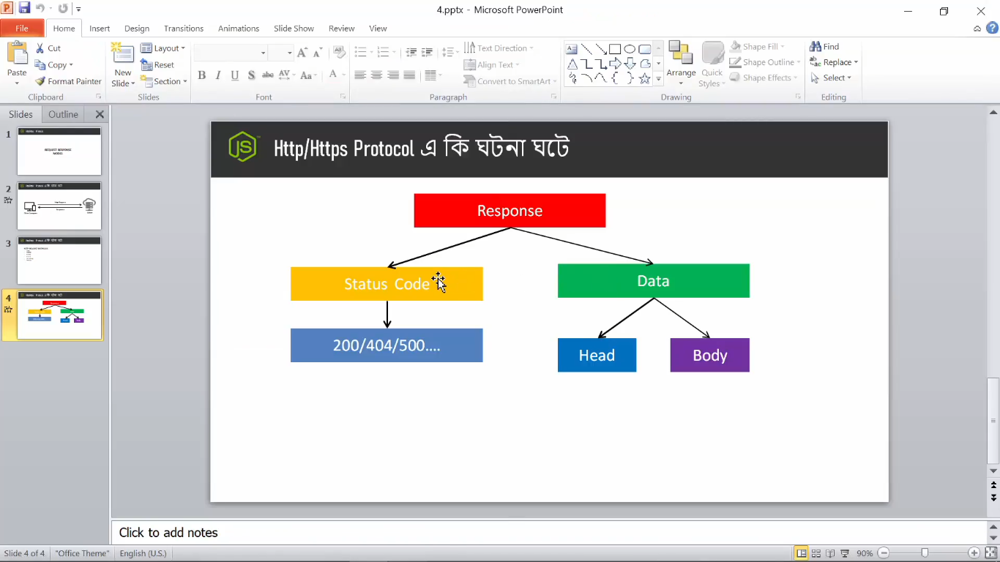
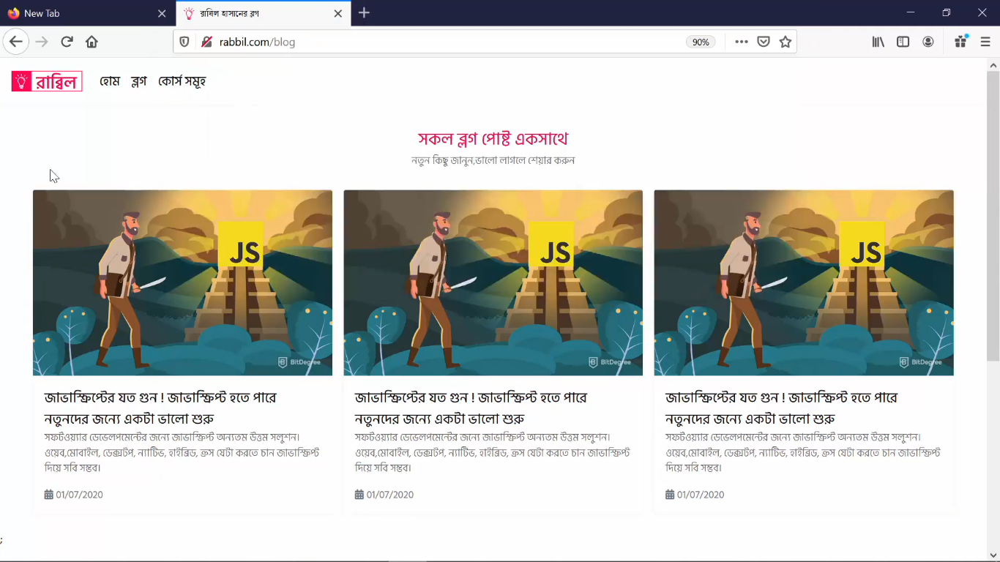
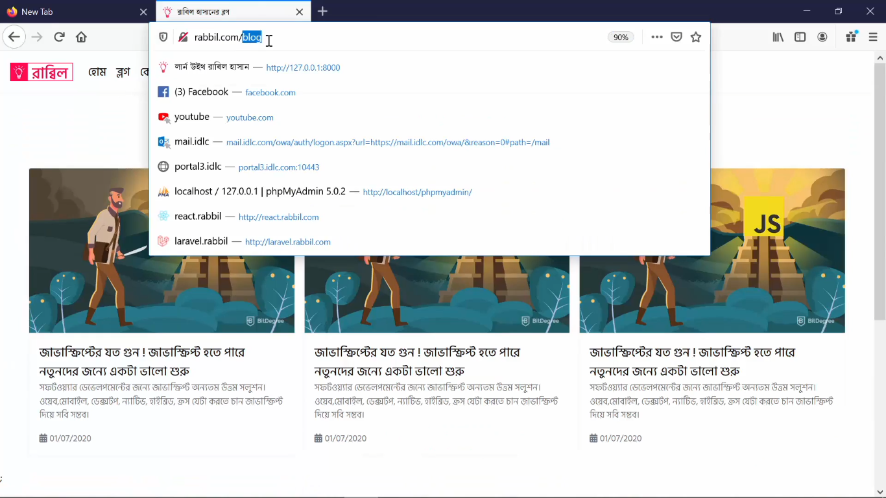
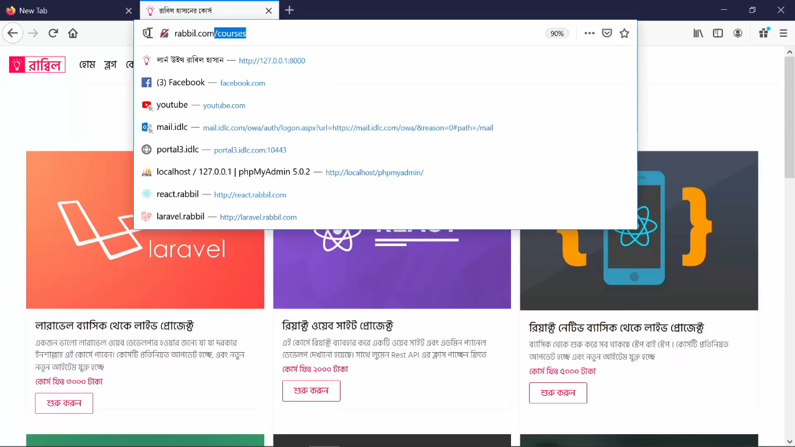
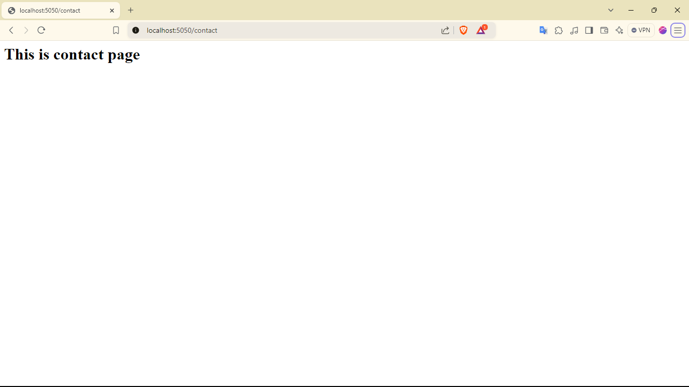
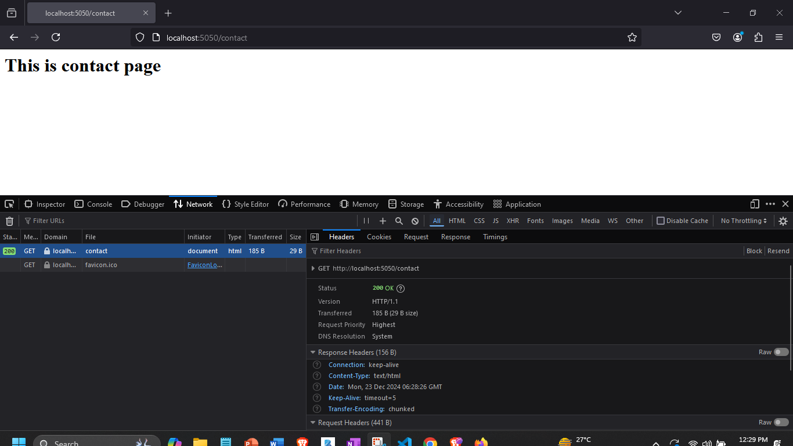
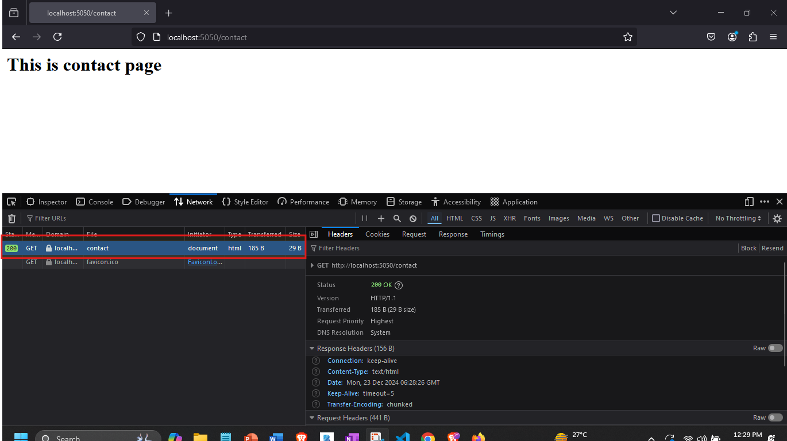

### Akhon amra dekhbo nodejs er request-response modelta kivabe kaj kore:


```javascript
//index.js

var http = require('http'); 

var server= http.createServer(function (req, res){

    res.end("hello world");
});

server.listen('5050');

console.log("Server running successfully");

 ```
###
- ### As you can see, er agher tutorial a amra nodejs er server make korecilam.
- ### And request response model k establish korer jonno ja ja dorkar tar sobkicui ai server er moddhe diye dewa ache.
- ### Req-Res model er jonno prothome amader request dorkar. Toh req k manage korer jonno aikhane "req" parameter ache. Then response dorkar hobe amader and response k manage korer jonno aikhane "res" parameter dewa ache.
- ### Akhon amra ai server er moddhe bibinno doroner request dite pari - get req, post req, http jkono req amra akhane dite pari. And shei req er against a amader server response generate korbe.
- ### And amra jani response er abr besh kicu ongsho takhe:

###
- #### Response er moddhe status code takbe,header takbe, body takbe ... toh ai puro bishoy gula amra akn aikhane dekbo.
- #### Akhon suppose dorun amra server a akta get request dibo. Server er moddhe get req url er maddhome khub shohoje dewa jai.
- #### Bishoi ta tik erokom : j dorun apni rabbil.com a dukhecen

###
- #### Shekhane giye apni blog page a chole gelen.

###
- #### Toh blog page a apni jokon gelen, url ta valo kore keyal korun. Shkane ashlo "/blog". ai /blog er maddhomei muloto server a akta req chole gelo. shei req er against a j respnonse ta ashce shetai muloto viewport a visible hocce.

###
- #### Abr dorun apni course shomuho er page a gelen. ai page a jawar sathei ai j "/courses" url er maddhome sever a akta req gelo. Shei req er agianst akta response ashce. J response ta viewport a visible hocce.


###
- #### Toh amra akn url er maddhome kibabe req handle kora jai sheta dekbo:


```javascript 

//index.js


var http = require('http'); 

var server= http.createServer(function (req, res){
    //1. toh dorun ami aikhane url er madhome req handle korbo: j jodi home url a req ashe shekhetre amra akta response create korbo:
    if(req.url === '/'){
        //4. akn question hocce response a ki ki thakte pare?
        //5. amra kintu uporer dewa 1 no. diagram teke dekte pacci, response a status code takbe,response header takbe,response body takbe etc takhte pare responser moddhe.
        //6. So aikhan teke j response ta jabe shekhane ami first a head diye dicci. Er jonno amra response er writeHead() method k call korbo. So head er moddhe amra response er status code dite pari,aikhane r o onk option dewa jai jemon content type diye dite pari, r bakigula amra gradually shikte takbo. Apatoto amra aikhane status code and content type dicci.

        res.writeHead(200,{ 'Content-Type': 'text/html'}) //7. content type dewar jonno ami aikhane akta object create korlam. Ei obj er vitore sudumatro content type noi er moddhe amra r o onk kicui dite parbo. Jgula amra pore shikbo.
        //9. Toh res er head er por akn amader response er body lagbo.
        //10. body dewar jonno amra res teke write() k call korbo.
        res.write('<h1>This is home page</h1>')
        //12. Akn amader jehetu response er body dewa sesh and r kicu ai muhurte dewar moto nai, tai amader k server k janate hobe j amader response dewa sesh tumi akn response k end kore daw. Er jonno amader res.end() k call korte hobe tailei hoye jabe;
        res.end();

         
    }
    //2. abr dorun amra /about jodi req ashe shetar jonno o akta response generate korbo:
    //8. Akhon ai j responser head ami home er jonno liklam sheta mai about and contact url o likhe dilam.
    //11. Ekivabe home url er j response body, sherokom body ami about and contact er jonno o likhe dite parbo.
    //13. Ekivabe ami baki url er response k o end kore dilam.
    else if(req.url == '/about'){
        res.writeHead(200,{ 'Content-Type': 'text/html'})
        res.write('<h1>This is about page</h1>');
        res.end();
    }
    //3. abr akhivabe amra /contact req er jonno akta response generate korte pari:
    else if(req.url == '/contact'){
        res.writeHead(200,{ 'Content-Type': 'text/html'})
        res.write('<h1>This is contact page</h1>');
        res.end();
    }  
    
});
//14. Remember aikhaner protiti reqeust e get request. And Protiti req er response hishebe head and body taktece.

//15. Akn amra server ta k run korte pari o/p dekhar jonno:

server.listen('5050');

console.log("Server running successfully");

```

### 
- ### And the o/p is:



###
- ### So as you can see: browser er viewport a shudu response er body dekha jacce but header dekha jacce na.
- ### header dekhar jonno:
    - ### inspect korun
    - ### Network tab a jan,
    - ### Network tab taka obostai page k reload dile tahole behind the seen req-res kivabe jacce-ashce ki gotce sheta network tab a dekte parbo:

###
- ### akhon ai get request er upor click korle amra request er details dekte parbo:

- ### ai details tar moddhe ami header er ja ja set koreci and response a ki ki diyeci sob dekte parbo.