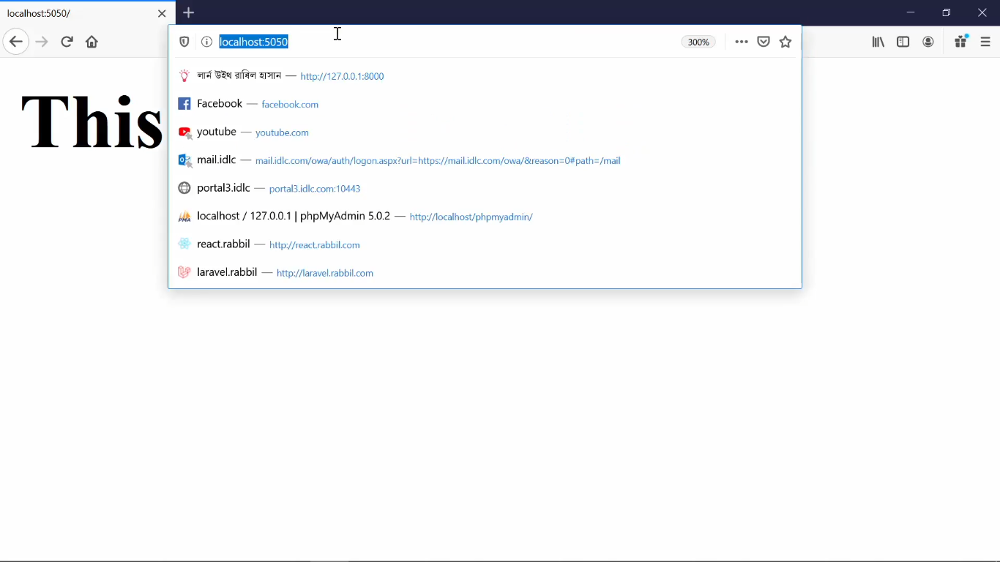
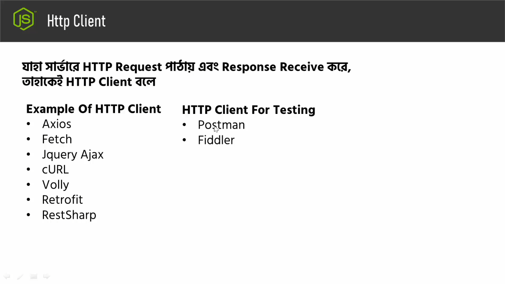
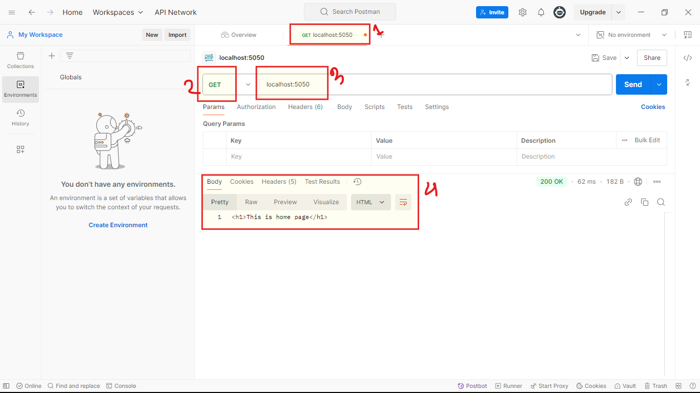

## Ai tutorial a amra alochona korbo HTTTP Client niye.
- ### HTTTP client ki?,HTTP client kivabe kaj kore? ai bishoy gula shomporke kintu, ekdom clear understanding apner takthe hobe. Sudu matro j nodejs er khetre clear understandin thakte hobe HTTP client shomporke ta kintu noi, As a software developer, as a software enginner apnake http client kuv valovabe bujtei hobe. R jodi apni na bujhe takhen tahole sheta apner jonno boro doroner berthota hobe.

- ### HTTP client niye alchona suru korbo purber lecture er shutro dhore. Er agher videote amra dekeci amra server a request pataici browser theke. Abr request er against a j response ta ashcilo shetao browser a. Orthad req patano and response recieve kora ai 2ta kaj amra korecilam browser k bebohar kore.

- ### Akhon sob doroner software a j browser thakbe bishoita kintu erokom noi. Dorun apni akti native android application make korcen shekhane kintu browser thakbe na, Apni akti native iOS application make korcen shekhane o kintu browser thakbe na ba dorun apni akti desktop application make korcen shekhaneo browser nei, abr apni dorun akti IOT device niye kaj korcen shekhaneo browser takhbe na. Toh shekhetre apni ei request-response model k exicute korben kivabe? - browser toh shekane nei!

- ### Tokon ai bishoi ta k handle korte hole shekhetre apnake HTTTP Client bebohar korte hobe.

- ### browser jrokom aikhane request patacce, abr response recieve korce tik sheirokom HTTP client server a request patabe and server tekhe j response ashbe shei response ta sha recieve korbe.

- ### Tahole http client kake bole?
    - ### HTTP client hocce amn akta client ba amn akta library ba ek guccho amn akta module j module server a request patai and server teke j response ashe shei response ta k recieve kore. Ek kothai atai hocce http client.

- ###
    - ### Toh bibinno programming language er kintu bibinno rokomer http client ache. jerokom: axios, fetch, Jquery Ajax ai 3ta http client hocce JS programming language er.
    - ### cURL hocce php er http client.
    - ### Volly, Retrofit hocce javar http client.
    - ### RestSharp hocce dotnet er  http client.
- ### Erokom apni jei programming language niye kaj korun na keno sob programmin language eri http client royece. Atokkon porjonto ami j HTTTP client gular kotha bollam shegula amra development er somoy use kori. 
- ### Onk somoy amader testing er proyojon hoi: j amader req tikmoto jacce kina, response ashce kina, so erokom testing purpose er kajgula shohojvabe korer jonno amra http client hishebe Postman/ Fiddler use kori. Ai 2tar moddhe Postman tai beshi bebohar hoi. Just for general knowledge Postman er software abr eloctron js diye toiri kora.
- ### Er agher tutorial a amra browser diye req pataicilam and response recieve korecilam. Aiber ashun http client postman diye request patano jak. Er jonno ami agher tutorial a make kora server ta k abr o run koralam. And postmanta open korlam:
    1. ### First a akta new tab open korlam postman open howar por.
    2. ### Get request select korlam.
    3. ### J url ta k get korte caici sheta k paste kore dilam and send button a click kore send kore dilam. Toh aikhane send korle amra browser er network tab a ja ja korte pari aikhane o shob kicu korte parbo ba dekte parbo.
    4. ### 4 no. box er menu gula navigate kore amra amader desired o/p gula dekhe nite pari.

- ### Nodejs niye kaj korer somoy amra server a bibinno dhoroner request : get req, post req, req er parameter dibo, header diye data pass korabo, body diye data pass korabo, amra json req dibo, multiplatform data req dibo, bibinno doroner amra request dibo, bibinno doroner response niye amra kaj korbo. Toh ai request-response er j bishoiguli sheguli k test korer jonno amra postman bebohar korbo. Req-Res model k test korer jonno postman best akta tool.
