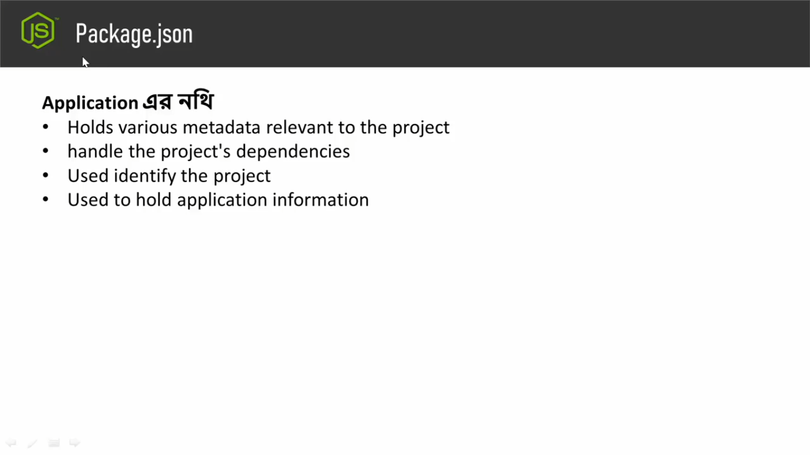
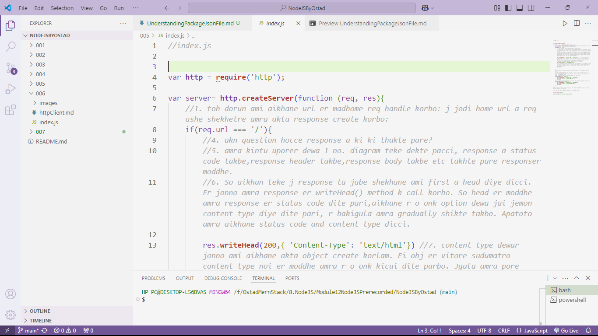
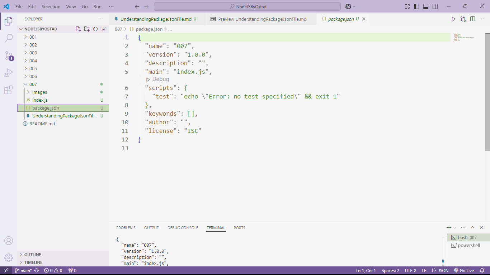

## **Ei porbhe alochona korbo package.json file niye**
- ### Toh ai package.json file ti j sudumatro nodejs application er vithore tahke ta kintu noi, R o onnanno bibinno dhoroner application er vithore o development er somoy amra package.json file ti peye jai.

## ** Ai package.json file ta ki?,ata diye ki hoi?,ei shomporkhe akta clear idea amader thakte hobe.
- ### Ek kothai bolte gele package.json file application er nothi("নথি" বলতে বোঝায় কোনো তথ্য বা বিষয়বস্তুর লিখিত বা ডিজিটাল রেকর্ড, যা প্রমাণ বা রেফারেন্স হিসাবে ব্যবহৃত হয়। এটি হতে পারে সরকারি কাগজপত্র, চুক্তিপত্র, রিপোর্ট, বা অন্যান্য গুরুত্বপূর্ণ নথিপত্র।).j nothir vitorei oi application shongkranto bibinno bishoi gula shajano guchano obostai thake.



###
- ### Jerokom dhorun apner application related j meta data gula shei meta data gala package.json file er moddhe thake.
- ### Application a amra bibinno somoy bibinno third party dependency use kori, bibinno libarary use kori, framework use kori - Toh kon file framework amra bebohar korlam, kon library bebohar korlam, shegular version ki, shei shongkranto tottho(information) gula amader pacakage.json file er vitor thake.
- ### Achara protthekta application er akta identification er bishoy ache, protthekta application er jonno information er bishoy ache - application name, application version, ai shongkranto data gula package.json filer bithore thake.
- ### ai porjonto amra ja dekechi:



```javascript 

//index.js


var http = require('http'); 

var server= http.createServer(function (req, res){
   
    if(req.url === '/'){
        res.writeHead(200,{ 'Content-Type': 'text/html'}) 
        res.write('<h1>This is home page</h1>')
        res.end();
    }
    else if(req.url == '/about'){
        res.writeHead(200,{ 'Content-Type': 'text/html'})
        res.write('<h1>This is about page</h1>');
        res.end();
    }
    else if(req.url == '/contact'){
        res.writeHead(200,{ 'Content-Type': 'text/html'})
        res.write('<h1>This is contact page</h1>');
        res.end();
    }  
    
});

server.listen('5050');

console.log("Server running successfully");

```
- ### 
    - ### Dektei pacco, ekhono porjonto amra kono package.json namer file make kori ne.
    - ### So amader package.json namer fileta make kore nite hobe. Ai file amader application shongkranto meta data gula k hold korbe, amader application er bithore amra jodi third party dependency add kori shegula k index korbe, shohoj kothai application er nothi bolte ja bojai sha shob thakbe hocce package.json file a.
    - ### package.json file create korer jonno terminal giye:
        - ### ```npm init``` command dilei package.json file create hobe.
            - ### ai command run korale abr onkgula questioner answer dite hobe like, application er nam ki, version koto etc. And ei question gula k ignore korte chaile apni nicher command use korben.
        - ### ```npm init --y``` ai command run korale r kono question korbe na and porobortite caile amra ai qustion gular answer abr notunvabe set o korte pari.
        - ### Ekhon jodi amra package.json file er bithore jai:

- ### 
    - ###
        - ### Toh ai package.json filer moddhe application er name, version, description, application er starting point peye jabo. Tarpor application er keyword thakte pare, author er nam thakte pare, Application er license thakte pare - Ei j information gula shegula muloto thake hocce package.json file er moddhe.
        - ### akhon ai package.json file er moddhe script property er vithore ami notun property add korbo "start":
```javascript
//package.json

{
  "name": "007",
  "version": "1.0.0",
  "description": "",
  "main": "index.js",
  "scripts": {
    "test": "echo \"Error: no test specified\" && exit 1",
    "start": "node index.js" // ai script property er moddhe amra bibinno doroner command as key-value pair hishebe rekhe dite pari j gula k amra porobortite kuv shohoje terminal diye run korate pari.
  },
  "keywords": [],
  "author": "",
  "license": "ISC"
}
 ```
 - ### 
    - ###
        - ### jehetu akn amader application run korer jonno command set korai ache package.json file a, tai akn r amder application run korer jonno oto boro line ``` node index.js ``` likhte hobe na, amra sudu ``` npm run start ```(ata sob "script" property k run korate kaj korbe ```npm run property-name ``` ) ba ```npm start ```(ata specific property er khetre kaj kore sudu.) terminal a run koralei amader application run hoye jabe.