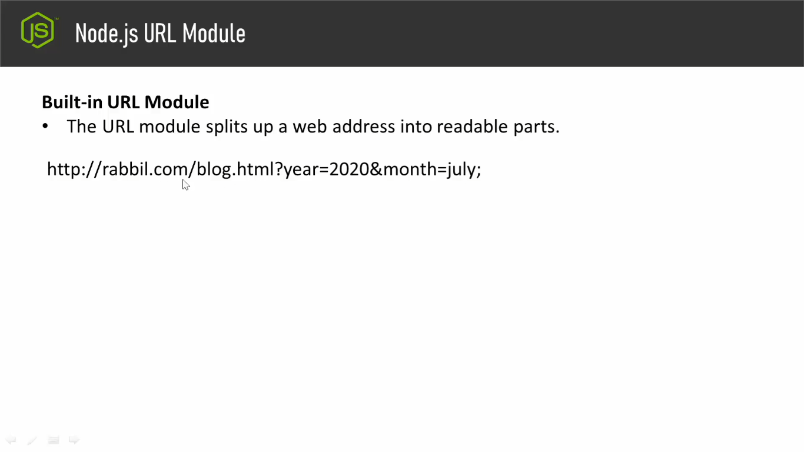

## **Ai tutorial a amra alochona korbo nodejs url module niye.**
- ### ai module nodejs er nijossho built in module.
- ### amra ai module use kore web address k bibinno readable part a vag(separate) kore dite pari.


- ### 
    - ### Chobite akta url dewa ache. Toh ei url er kintu alada alada bibinno ongsho ache. alada alada ongsher kintu alada alada name ache. url tar ``` http://rabbil.com``` ai ongsho k bola hoi "host name", ```/blog.html``` hocce url er "path name", then what(?) diye lekha ache ```year```,```month``` - ai perameter gula k bola hoi url er "query" ba "search query".
    - ### Amra URL module diye khub shohojei url er host name, path name, query k benghe benghe alada kore felte pari.

    - ### Toh cholun ai bishoi ta practically dekha jak:
```javascript
//index.js


const { write } = require('fs');
var http = require('http'); 
//1. Toh url module niye kaj korer jonno "http" module k amra jvabe add kore diyeci tik samevabe amra url module k o add kore nibo:
var URL  = require('url');
var server= http.createServer(function (req, res){
   //2. akhon ami cacci j url k venghe tukra tukra kore felbo:
   //3. Toh doru ami ei "http://rabbil.com/blog.html?year=2024&month=december" takei venghe tukra tukra kore felbo. Er jonno first a ami ai url ta k akta variable er moddhe rekhe dicci.
   var myURL = "http://rabbil.com/blog.html?year=2024&month=december";
   //4. akn ai url k venghe tukra tukra korer jonno amra url module tekhe url.parse() method k call korbo.Ata 2ta arguments nibe akta "url" and onnta boolean value- "true", url k venghe tukra tukra korer jonno.
   var myURLObj = URL.parse(myURL,true);//5. ata akta object return korbe. j object er vithore hostname,pathname,subquery alada alada vabhe obostan korbe.
   //6. jemon dorun amra jodi ai object tekhe host name k alada korte chai tahole:
    var myHostName = myURLObj.host;
   //7. ekivabhe:
    var myPathName = myURLObj.pathname;
   //8 Then ekivabe amra j search query gula seshe likhechi, Shei search query gula k jodi amra alada kore felte chai:
   var mySearchName = myURLObj.search;
   //10. amra chaile body k write korer sathe sathe head k o write korte pari:
   res.writeHead(200,{ 'Content-Type': 'text/html'})
   //9 akhon aigula k dekhar jonno:
   res.write(myHostName);
   res.write('</br>');
   res.write(myPathName);
   res.write('</br>');
   res.write(mySearchName);
   //11. Then ami response k end kore dibo;
   res.end();
    
});

server.listen('5050');

console.log("Server running successfully");

```
