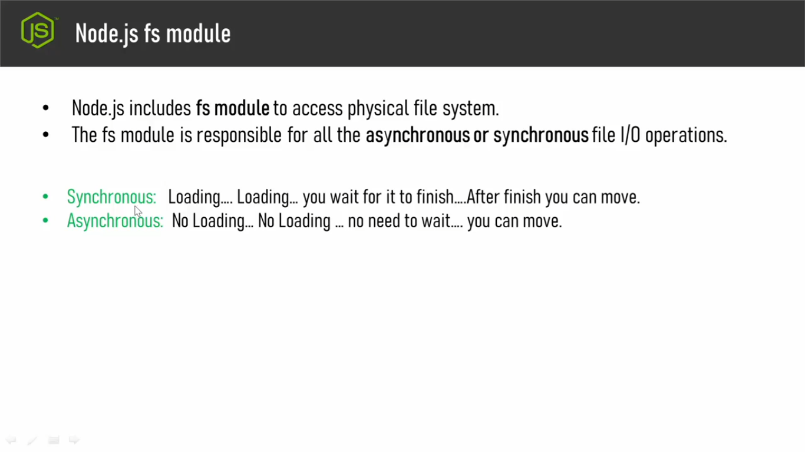
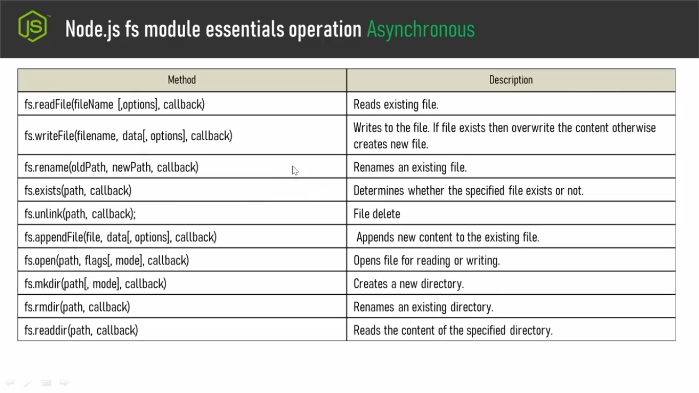
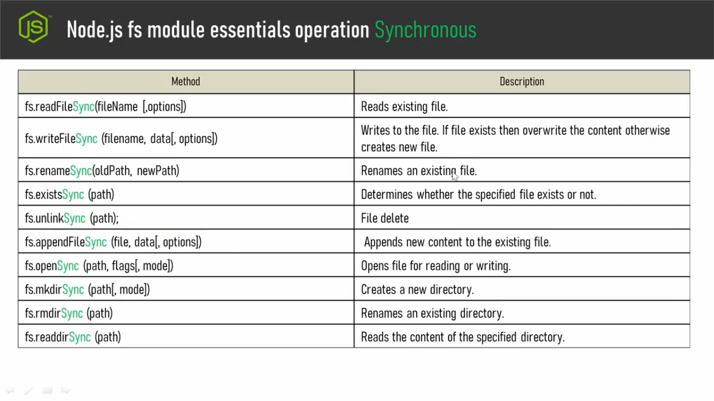

## **Ai video tekhe amra alochona suru korci nodejs fs module niye.**
- ### f for file and s for System orthad file system module.

- ### Toh node js er j file system module ta ache sheta bebohar kore amra server er jkhono file k physically access korte pari, file k edit korte pari, file delete korte pari, notun file create korte pari, orthad file management bolte ja bujai tar shobi kora jai fs module bebohar kore.
- ### fs module bebohar kore amra jokon kono operation chalai tokon shei opearation gula 2 rokomer way the hote pare.Hote pare sheta synchronus, hote pare sheta asychronus. Ei tutorial a synchronus and asynchronus niye overview dewa hobe. Poroborthite aigula niye bistarito alochona kora hobe. 
- ### Jodi apner website er opertion gula ba fs module gular operation jodi erokom hoi j oi operation ta sesh na howa porjonto apni onno kono operation a move korte parcen na orthad multitasking korte parcen na - bishoi ta tik eirokom, dorun apni website a akta video uploader jonno diyechen, jotokkon porjonto video ta upload hoy ne totokkon porjonto apni onno r kono kaj korte parcen na orthad multitasking korte parcen na tokon ai doroner operation k bolci synchronous.
- ### Abr jodi erokom hoi j user ekhoisathe  website er moddhe ba webapplication er bithore multi tasking korte parbe, j kono akta task er jonno r ekta task themhe thakbe na shei dhoroner process k bolbo amra asynchronous.
- ### ei fs module er moddhe abr onk method ache.Toh onkgula method er moddhe j method gula beshi use hoi shegular list niche dewa holo: 
- ###

- ### Eichara o fs module diye r o onk kicui kora jai, kintu shegular ashole as usual amader proyojon hoi na. Tai ai talikhar moddhe shegula k dewa hoi ne.