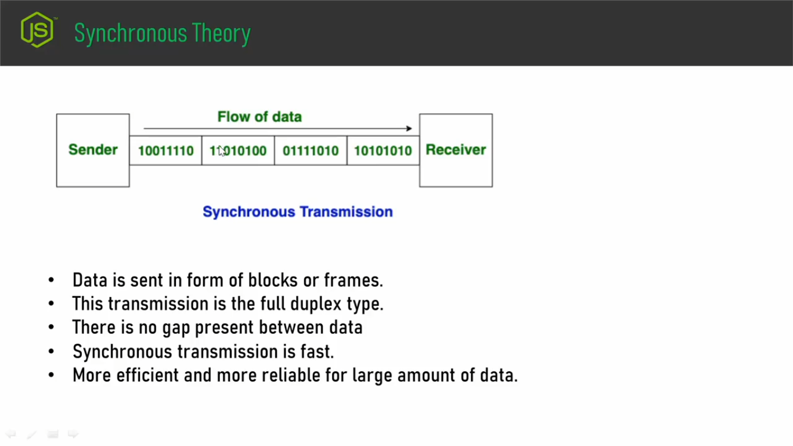
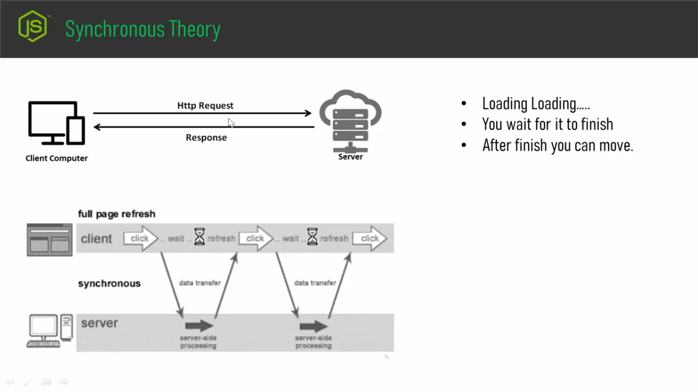
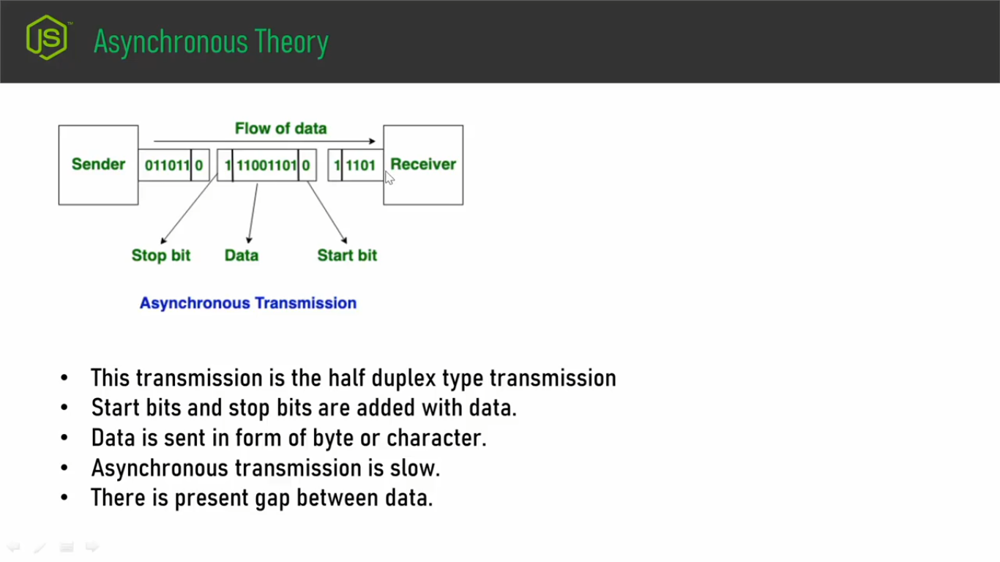
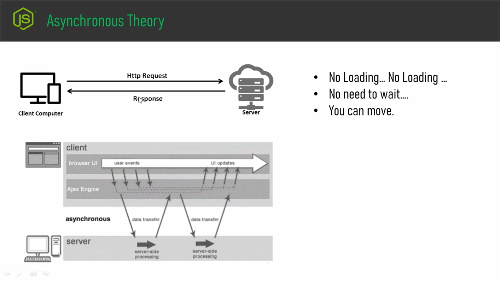
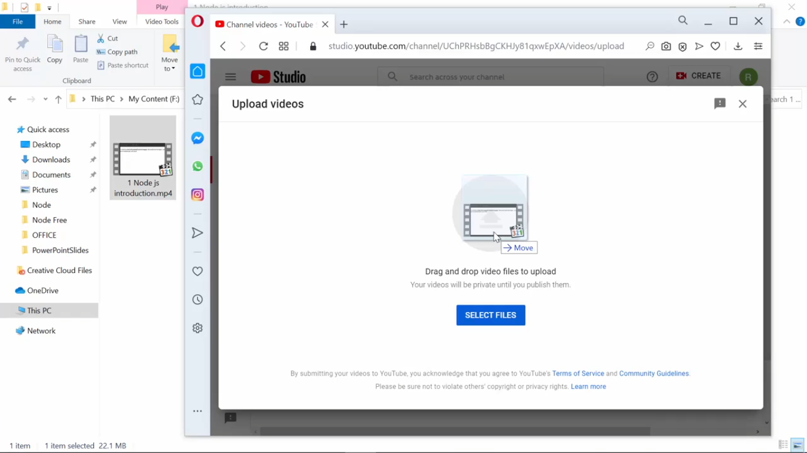
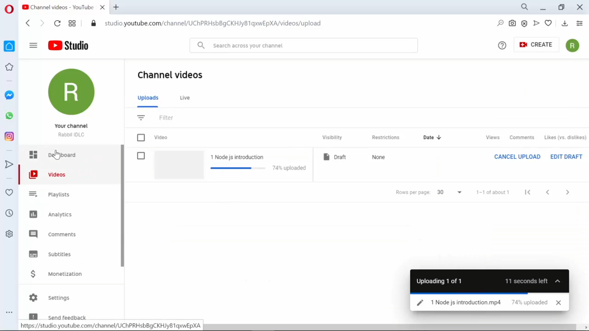

## **Ai video the Synchronous and Asychronous j duiti process ache ai duita process niye alochono korbo.**
- ### Toh sudu j node js er jonno ai process duita gurutho purno bishoita kintu tik sherokom noi. As a software engineer ba as a software developer apni jei platformei kaj korun na keno jei technology niyey apni kaj koren na keno synchronous-asynchronous er j concept sheta sob jaigathei apner kaje lagbe.

- ### Toh prothomei ami synchronous-asynchronous er j theorytical bishoigula ache shegula niye first a alochona kora hobe then akta real example dewa hobe ai tutorial a.

- ### Toh prothomei ashun synchronous theory ta buja jak:

- ### Toh aikhaner apnara akta chobi dekte paccen.Ai chobite keyal kore dekhle dekben sender er kach tekhe reciever er kache data patano hocce.
- ### And  Data patanor shomoy Data gula k specific block ba frame akhare patano hocce.
- ### Aikhaner 4 ta block amra dekte pacci. Pashapashi 2 ta Block ba frame er majhe aikhane kintu kono gap(ba amra ai gap k delay hishebe o chinta korte pari) nei.
- ### Toh amra sender er kach tekhe jodi reciever er kache erokom vabe data patai, j data gula patanor somoy data gula block ba frame akhare jabe and frame gular majhe kono gap thakbe na tokon ai j process ta ba transmission system ta ai transmission system takei bolci synchronous transmission system.
- ### Akhon ai synchronous trnasmission system a jehetu block er majhe kono gap thakce na and data block akhare jacce aikharone ai process ta kintu jotesto fast. and apni large amount er data ai process a apni sender er kach tekhe reciever er kache patate paren. Jothesto efficient way the ata kaj korbe.

- ### But ai synchronous a ashe j problem ta hoye jacce sheta hocce: Amra jehetu web development er somoy maximum khetre request-response model use kori, toh ei req-res model a apni jodi synchronous process a kono operation execute koren shekhetre sha operation ti jotokkon porjonto finish hoi ne totokkho porjonto apni onno operation a jete parben na. Bishoyta tik eirokom j :
    - ### loading loading loading ... 
    - ### You wait for to finish it.
    - ### After finish you can move.
- ### Orthad jokoni apni kono process exicute korben shei process ta jotokkon porjonto finish hoi ne totokkon porjonto apni onno kono process a jete parben na. Shei process finish hobe then tarpore apni onno kono proceess a jete parben. Shohojvabe bolte gele apni aikhane multi tasking korte parben na, Ekishathe apni onkgula process chalate parben na.
- ### Bishoyta tik erokom(Uporer chobir nicher diagram ta dekho) j client side tekhe server side a akta request ashlo, request jotokkon porjonto execute hoi ne totokkhon porjonto client k wait korte hobe. Request execute hoye finish hoye gelo then abr client notun r akta request korte parbe. Sha request abr jotokkhon porjonoto finish hoi ne totokkhon porjonto client k wait korte hobe.Shei Request finish hole  aber sha next request a jete parbe. Orthad you have to wait for finish.

- ### But Asynchoronous a ashe jta hocce data gula byte by byte ba character by caharacter a data gula flow hocce. And datar majhe gap thakce. Datar majhe ei j gap gula, gap gula kototuku hobe sheta kintu specific na. Gap boro o hote pare,Choto o hote pare. 2ta character ba byte er majhe jerokom gap hobe, onno 2ta datar khetre gap kintu sherokom hobe na. Aikharone  Asynchoronous poddhotithe jokon apni data transfer korben data transfer er j process ta kintu jothesto slow hobe.
- ### But ata slow holeo aikhane r akta shubidha ache shei shubidata hocce j specific kono task finisher jonno wait korte hobe na. Ai kharone ami bolci:
    - ### No loading... No loading...
    - ### No need to wait...
    - ### You can move.
- ### Orthad kono akta req jokhon apni execute korben sha request finish holo kina shetr upore apnake nirborshil hote hobe na shei process ta cholakalin shomoyeo apni onno r akta process chalaite parben. Shohoj kothai apni multitasking korte parben.       

- ### Toh ei hocce asynchornous and synchronous er moddhe j theroiticall bishoigula shei bishoigula. Akhn akta real example apnader dewa jak asynchronous niye:

- ### Real example dewar jonno ami aikhane youtube a ashechi.

- ### dorun ami youtube akta video upload dibo. Upload dewar somoy ami kintu aikhane multi tasking korte parbo.

- ### as you can see video upload o hocce, ekishate ami side menu te visit korte parci and kaj korte parci. 
- ### Orthad video upload akta process and ai process er jonno amk wait korte hocce na.Tahole amra bolte pari aikhane j process a video upload hocce sheta akta asychronous poddhoti.
- ### But jodi erokom hoto jotokkhon na porjonto video upload hocce totokkho ami r kono kaj korte parbo na tokon sheti hoto synchronous.