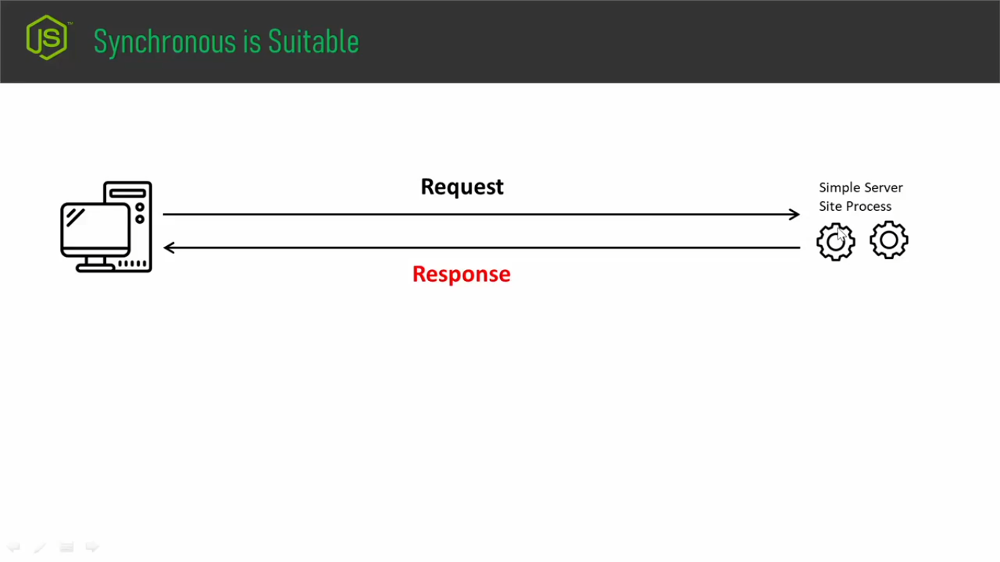
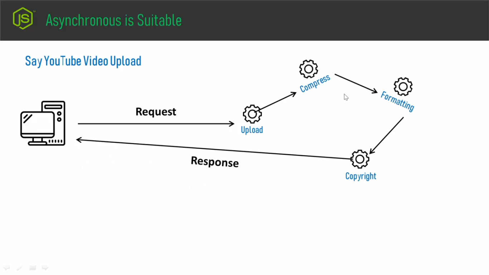

## **Ai tutorial a amra dekhbo kokon synchronous and kokon asynchronous bebohar korbo.**
- ### Prothomei ashun jene nei kokhon synchronous suitable hobe:

- ### Dhorun client tekhe server a request patalen. Server a reqest ta ashar pore sever a simple kicu process run hoyece and howar por server tekhe akta response client er kache return chole geche.
- ### Toh tik erokom jodi hoi j, client tekhe server a request ashar pore server a kub simple kicu process run hoi, j process gula run hothe kuv beshi shomoy er proyojon hoi na, kuv druthoi response pawa jai shekhetre synchronous oboshoi suitable. Knona amra jani j synchronous poddhotite kono task finish na howa porjonto onno kono task a amra jete pari na. Toh jehetu akta task finish na howa porjonto amra onno kono task a jete pari na ai karone amader k mathai rakte hobe j, jekhane server side a amader somoy kom lagbhe shei shokol khetre amra synchronous use korbo. Knona user akta request patiye sudu ghontar por ghonta boshe tekhe sudu loading.. loading.. loading.. dekhbe - user toh sheta chaibe na. User toh chaibe j kuv dhruthoi jeno exicute hoye jai. Bah dhrutho exicute jodi na o hoi shegula jeno background a exicute hoi, exicute howar time a sha jeno multitasking korte pare.User kintu ai shubidha gula chaibe.Toh ai jonno amader korte hobe j, server side a jokon amader process gula simple hobe, jekhane khuv beshi jotilotha nei, kuv beshi shomoyer proyoujoniyotha nei shei shokol khetre amra synchronous use korte pari.
- ### But jodi erokom hoi j server side er process gula onk complex, onk gula step ache, processing a onk shomoy lagbe - Shekhetre kintu synchronous use kora jabe na. Shekhtre apnake asynchronous use korte hobe. For example: youtube a video upload.

- ### Amader computer tekhe youtube a jokon amra video k upload korci, server jokon amra video k patiye dicci, tokon j sudu matro video upload hocce, bishoita kintu sherokom na, upload howar poreo kintu shekhane r o onk ghotona ghotce:
    - ### upload howar pore youtube video takhe compress korce.
    - ### compress korer por abr shei video ta k bibinno resolution a formate korce.
    - ### formatting korer por oi video the kono copyright issue ache kina, violation ache kina evething kintu youtube sheta k check kortece.
    - ### Check korer por sob step jodi finish hoy jai tokon youtube amader process hoye jawar response patacce.
- ### Toh server side a giye ai j process gula hocce ai process gula kintu moteow simple kono process na - onk complex process and step by step sha process gula hoi.Toh jodi erokom hoi j server side a onkgula process thake, j process gula complete hote somoyer proyojon hoi,ai process gula fail hote pare, fail hole abr notun kore shuru korte hote pare, erokom jodi kon gotona hoi shekhetre apnake oboshoi asynchronous bebohar korte hobe.

- ### R aikhaner j shubidha ta dorun user jokon video ta upload kore dicce, upload howar por compress holo, compress hoye jawar pore formatting jokon hobe tokon formatting kono karone fail holo, formatting fail hole youtube background a formatting er jonno abr bar bar retry korte pare, orthad server side ashe jokoni complex process chole astece, j process gula kuv shohojhe hobe na, hote shomoy lagbe, ba fail hote pare, multiple try er proyojon ache erokom khetre amader k asynchronous j data transmission system sheta use korte hobe. Ba amra jokon req-res model a kaj korci tokon amader k asynchronous way tei kajgula korte hobe.   