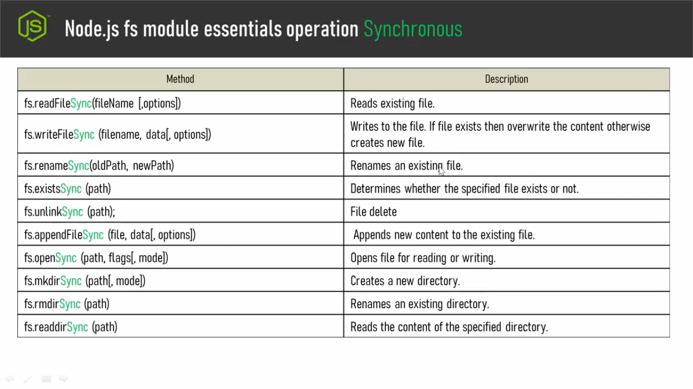
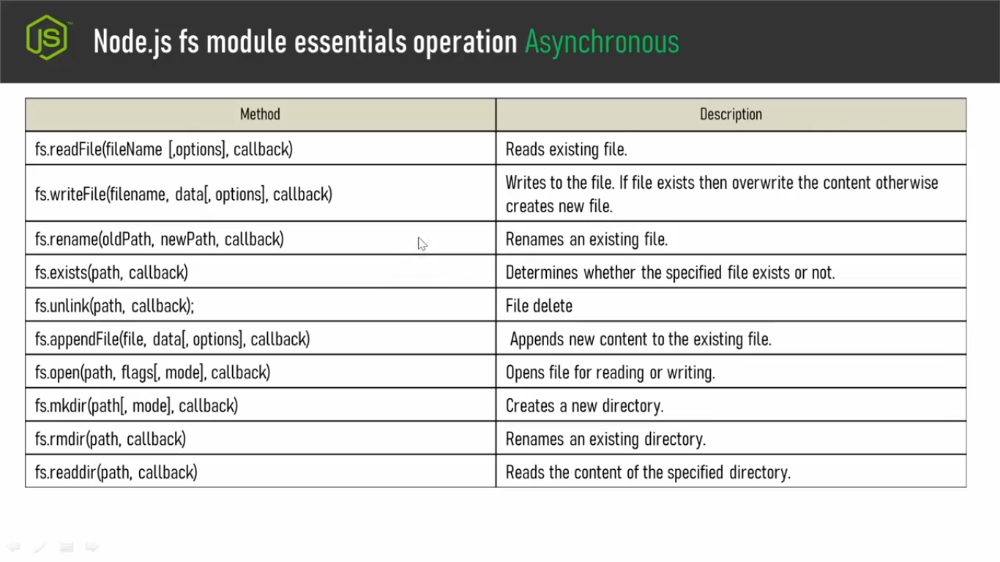

## **Ai tutorial tekhe amra fs module niye kaj kora suru korbo**
- ### Ai file system module er vithore onk gula method ache, sha method gular moddhe j j method gula beshi beshi proyojon hoi amader ami sha method gula er list aikhane diye dilam:
 
 
- ### Toh apni jokon fs module niye kaj korben tokon synchornous and asychronous 2 waytei kaj korte paren. Toh asynchronous process a jodi apni kaj koren shekhetre method er nam gula kmn hobe, method er perameter gula kmn hobe abr synchonous process a jokon apni kaj korben tokon method er name gula kmn hobe, parameter gula kmn hobe shegula amaderk prothome jene nite hobe.
- ### Toh prothomei ashun asynchronous process:
 
- ###
    - ### Asynchonous process a apni file read korte chaile fs.readFile() method use korben.
    - ### Write korte gele fs.writeFile().
    - ### Existance kono file er name jodi apni rename korte chan shekhetre fs.rename() use korben.
    - ### File exist kore kina sheta check korer jonno fs.exists() method ache .
    - ### file delete korer jonno fs.unlink() method.
    - ### file er bithore notun content add korer jonno fs.appendFile() method use korben.
    - ### file open er jonno fs.open() method.
    - ### notun directory make korer jonno fs.mkdir() method.
    - ### existing directory k rename korer jonno fs.rmdir() method.
    - ### Ekta directory er moddhe joto file ache sob read korer jonno fs.readdir() method apni bebohar korben.
 
- ### akhon asynchronous poddhotite method er name gula tik j rokom synchronous poddhotiteo method er namgula o tik ekirokom.Sudu mathro akta partokkho keyal kore dekun synchrounous poddhotite protthekta methoder namer seshe "Sync" shobdhota ache.
- ### ata gelo method er name. Er pore ashun parameter:

- ### apni jodi asynchronous poddhoti bebohar koren sheikhetre aikhane protthekta method er vithorei parameter hishebe apni akti callback function paben.
- ### Asynchronous poddhotite kaj sesh hoye jawar pore server jeno amader notify korte pare shejonnoi aikhane callback method ta ache. Kenona asynchronous poddhotite amra multitasking korte pari. Kono akta file k read korte diye apni onno r akta kajhe chole gelen, tahole onno akta kajhe j apni chole gelen, file j apner read hoye gelo ai hoye jawar shonghbad generate korer joono ai callback function protthekta method er moddhe ache.
- ### Synchronous poddhotite kono method er khetre keyal korle dekben parameter hishebe kono methodei ei callback function nei. Knona aikhane kaj hobe, poroborthite notify korbe ai bishoyta kintu aikhane nai. Aikhane jotokkhon porjonto kono task execution sesh hoi ne,totokkhon porjonto apni onno kono task a move korte parben na.

