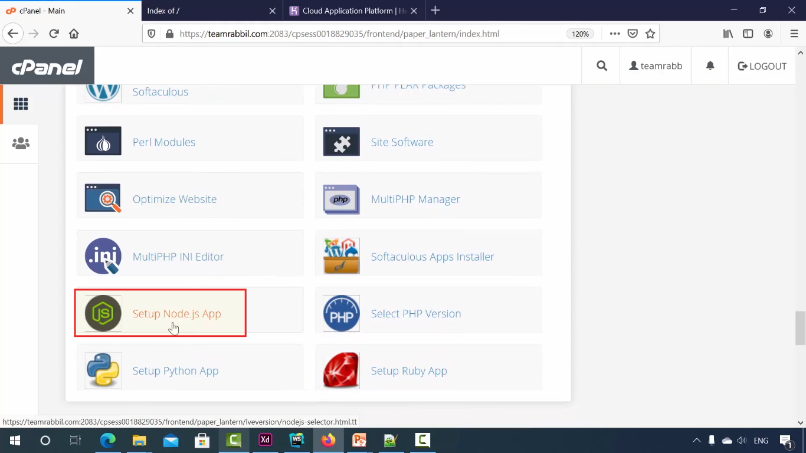

## **Ai tutorial tekhe amra amader first nodejs websiteti build kora shuru korbo and sheti k finall amra real server a deploy korbo**
- ### Amader website ti kintu kuvi simple hobe. 4 / 5 ta page thakbe . Ekta page tekhe r ekta page a navigate kora jabe.
- ### And website ta jokon amra deploy korbo tokon amra ekdom real domain hosting use korbo.
- ### Cholun tahole notun website ti toiri kora jak:
    - ### Prothomei ami `npm init --y` command terminal a run koriye `package.json` file create kore nilam sathe necessary changes kore nilam like below, jate `npm start` command diye amader project run korate pari.
```javascript

//package.json
{
  "name": "023",
  "version": "1.0.0",
  "description": "",
  "main": "index.js",
  "scripts": {
    "test": "echo \"Error: no test specified\" && exit 1",
    "start": "node index.js"
  },
  "keywords": [],
  "author": "",
  "license": "ISC"
}

```
- ### 
    - ### akhon ami index.js er moddhe akta server create kore nicci like below:
```javascript
//index.js

var http =require('http');
var fs = require('fs');

var server = http.createServer((req,res)=>{

});

server.listen(5050);
console.log('Server running successfully');
```
- ###
    - ### Akhon ai j application ta ai application ta amra real server a deploy korbo, toh real server a jodi deploy kori tahole ```server.listen(5050);```aikhaner listen er port number jaigata amra fakha rekhe dibo, faka rekhe dile ata by default server a giye server er local host niye nibe. And by default localhost er port hocce 8080.
```javascript
//index.js

var http =require('http');
var fs = require('fs');

var server = http.createServer((req,res)=>{

});

server.listen();
console.log('Server running successfully');
```
- ###
    - ### Er por Amra r koyekta page create kore nicchi:
        1. ### home.html 
        2. ### contact.html
        3. ### about.html
        4. ### terms.html
    - ### Amader website er 4ta page hoye gelo. Ai 4ta page er moddhe amra ekta tekhe r ektathe naviage korbo. Ai jonno ami html file gulate necessay code kore nicci like below:
```html
<!-- home.html -->

<!DOCTYPE html>
<html lang="en">
<head>
    <meta charset="UTF-8">
    <meta name="viewport" content="width=device-width, initial-scale=1.0">
    <title>Document</title>
</head>
<br>
    <a href="/">Home</a> </br>
    <a href="/contact">Contact</a> </br>
    <a href="/about">About</a> </br>
    <a href="/terms">Terms</a> </br>
    <hr>
    <h1>This is Home page</h1>
</body>
</html>
```
```html
<!-- contact.html -->

<!DOCTYPE html>
<html lang="en">
<head>
    <meta charset="UTF-8">
    <meta name="viewport" content="width=device-width, initial-scale=1.0">
    <title>Document</title>
</head>
<br>
    <a href="/">Home</a> </br>
    <a href="/contact">Contact</a> </br>
    <a href="/about">About</a> </br>
    <a href="/terms">Terms</a> </br>
    <hr>
    <h1>This is Contact page</h1>
</body>
</html>
```
```html
<!-- about.html -->

<!DOCTYPE html>
<html lang="en">
<head>
    <meta charset="UTF-8">
    <meta name="viewport" content="width=device-width, initial-scale=1.0">
    <title>Document</title>
</head>
<br>
    <a href="/">Home</a> </br>
    <a href="/contact">Contact</a> </br>
    <a href="/about">About</a> </br>
    <a href="/terms">Terms</a> </br>
    <hr>
    <h1>This is About page</h1>
</body>
</html>
```
```html
<!-- terms.html -->

<!DOCTYPE html>
<html lang="en">
<head>
    <meta charset="UTF-8">
    <meta name="viewport" content="width=device-width, initial-scale=1.0">
    <title>Document</title>
</head>
<br>
    <a href="/">Home</a> </br>
    <a href="/contact">Contact</a> </br>
    <a href="/about">About</a> </br>
    <a href="/terms">Terms</a> </br>
    <hr>
    <h1>This is Terms page</h1>
</body>
</html>
 ```
- ### 
    - ### akhon amra `index.js` tekhe html er page gula k read korbo:
```javascript
//index.js

var http =require('http');
var fs = require('fs');

var server = http.createServer((req,res)=>{
    if(req.url==='/'){
        let data = fs.readFileSync('home.html','utf-8'); //aikhane ami kon file read korbe shetar sathe character set 'utf-8' diye dilam. 'utf-8' jodi na dei kon file k method ta read korce sheta local host a bujthe parle o real server a giye bujte parbe na.
        res.end(data); 
    }else if(req.url==='/contact'){
        let data = fs.readFileSync('contact.html','utf-8'); 
        res.end(data); 
    }else if(req.url==='/about'){
        let data = fs.readFileSync('about.html','utf-8'); 
        res.end(data);      
    }else if(req.url==='/terms'){
        let data = fs.readFileSync('terms.html','utf-8'); 
        res.end(data);    
    }
});

server.listen(5050);
console.log('Server running successfully');
```

- ### So this is our first nodejs website. Amader website toiri kora shesh cholun tahole akhon ata k deploy kora jak:

- ### Deploy korer jonno amra chole ashechi `https://teamrabbil.com` - j domain ta ache, shei domainta j hositing er sathe connected ache shei hosting a amra chole ashechi. Toh ai obostai amra jodi `teamrabbil.com` visit kori:

- ### keyal kore dekhun aikhane akhon kiccu nei. Totally faka.

- ### Toh nodejs application deploy korer jonno, amader j linux cPanel ache shei linux cPanel a `Setup Node.js App` namer j menu ta ache shei menu ta use korte hobe. Tai amra shei option a chole gelam.

- ### `Setup Node.js App` option a jawar por apni notun akta nodejs application setup korer option `CREATE APPLICATION` peye jaben. So ami option tathe click kore dilam.

- ### Click korer por ami ai page a navigate hoye gelam. Akhon application ta j ami create korbo, er jonno amader kicu information akhane dite hobe amader. Jemon:
    - ### first a amder nodejs er version select kore dite hobe. Ami recomended version tai select kore dilam.
    - ### Application mode Development select kore dilam.

- ### 
    - ### Er por ashun applcation root. Application root mane hocce application ta kothai jabe ba root location konta.So ai case a root location ta hocce teamrabbil.com.
    - ### Er por ashun applcation url. Application url by default aikhane teamrabbil.com set hoye ache shetai thakuk cause ami aikhnei amader application ta deploy korbo.
    - ### Tar por ashun Application startup file. Startup file mane hocce kon file diye apnr appliation ta suru hobe. As you already know, amader case a shei file ta hocce `index.js` cause amra shekhanei amader server create korechi. Thats why ami aikhane likhe dilam `index.js`. 
    - ### erpor amra `create` option a click kore dibo. Click korle amader applicationti create hoye jabe.


- ### keyal kore dekhun amader notun akta nodejs application create hoye gelo. And sheta kothai create hoye gelo? - `TEAMRABBIL.COM/` directoryte create hoye gelo. Akhon amra jodi `https://teamrabbil.com` address ta k reload dei:

- ### keyal kore dekhu akn kintu r faka ashe ne. Notun akta j nodejs application create hoye gece sheta aikhane show hocce. Akhon nodejs application ta j toiri hoye gece sheta dekhar jonno amra file manager a jabo.

- ### aikhan teke `File Manager` option a click korle amra `File Manager` a navigate hoye jabo.

- ### Jawar por:
    1. ### `teamrabbil.com` directoryte click korbo.
    2. ### `index.js` a giye mouse er right click korbo, korle `edit` option peye jabo, shekhane amader website er j `index.js` fileti ache shetar content amra oikhane paste kore dibo.

- ###
    3. ### Er por ami uplod menutate click koram

- ###
    4. ### Er por ami amader project er sob html files (only html files) upload kore dilam.

- ###
    5. ### upload korer por amader k oboshoi amader server k restart korte hobe nahoi changes gula dekhabe na. Er por amra jodi `https://teamrabbil.com` a visit kori:

- ### so dekhtei paccen amader first nodejs website real sever a deploy kora hoye geche😊

